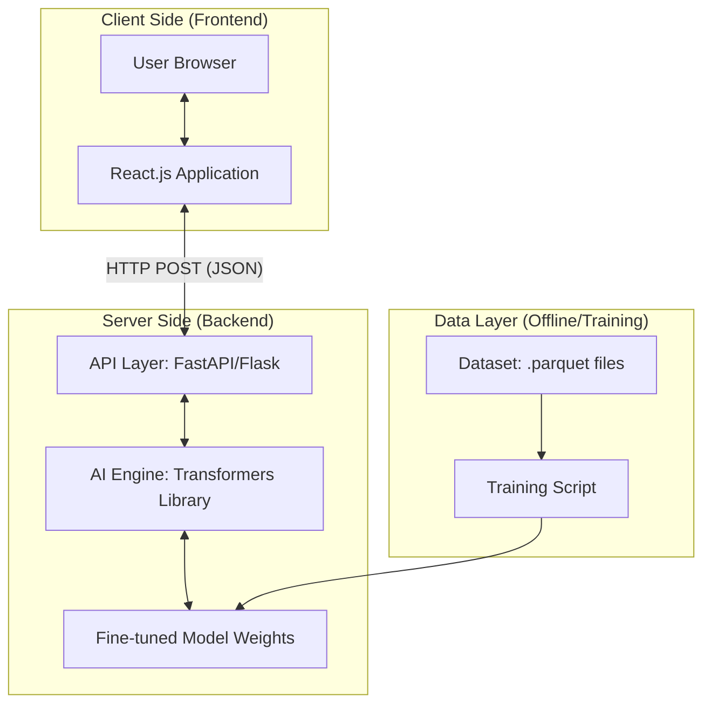

# Software Requirements Specification (SRS)

**Project Name:** AI-Powered Short Story Generator System  
**Version:** 1.1  
**Status:** Final Design  
**Author:** Nguyen Minh Thanh

---

## 1. Introduction

### 1.1 Purpose
The purpose of this document is to provide a detailed description of the "AI-Powered Short Story Generator" system. It outlines the functional and non-functional requirements, the system architecture, the data workflow, and technical implementation guidelines for both Frontend (React) and Backend (Python) components.

### 1.2 Scope
This system is an AI-driven web application that allows users to input specific parameters (Character Name, Personality, Setting, and Theme) to automatically generate a coherent short story (100–200 words).

The system involves:
- **Training Phase:** Utilizing `.parquet` datasets to fine-tune a Transformer-based Language Model.
- **Inference Phase:** A web application providing a real-time interface for story generation using the trained model.

### 1.3 Definitions, Acronyms, and Abbreviations
- **FE:** Frontend  
- **BE:** Backend  
- **NLP:** Natural Language Processing  
- **API:** Application Programming Interface  
- **Fine-tuning:** Adjusting a pre-trained model on a specific dataset  
- **Inference:** Using a trained model to generate output  
- **CORS:** Cross-Origin Resource Sharing  

---

## 2. Overall Description

### 2.1 Product Perspective
The system follows a decoupled Client-Server architecture:
- Frontend: React (SPA)
- Backend: Python (FastAPI/Flask)
- Communication: RESTful API

### 2.2 Product Functions
- Input Management  
- AI Story Generation  
- Result Display  
- Data Processing (.parquet → training format)

### 2.3 System Architecture



---

## 3. Functional Requirements

### 3.1 Frontend Requirements (React.js)

| ID        | Requirement        | Description |
|----------|------------------|------------|
| FR-FE-01 | Input Form        | Form with Name, Personality, Setting, Theme |
| FR-FE-02 | Form Validation   | Prevent empty submission |
| FR-FE-03 | Loading State     | Show loading spinner |
| FR-FE-04 | Result Display    | Show generated story |
| FR-FE-05 | Error Handling    | Show API error messages |

### 3.2 Backend Requirements (Python)

| ID        | Requirement        | Description |
|----------|------------------|------------|
| FR-BE-01 | RESTful Endpoint  | POST `/generate` |
| FR-BE-02 | Model Loading     | Load model at startup |
| FR-BE-03 | Prompt Construction | Convert JSON → prompt |
| FR-BE-04 | Inference Engine  | Generate text |
| FR-BE-05 | API Response      | Return JSON result |

---

## 4. Detailed Data Workflow

### 4.1 Step-by-Step Sequence

1. User fills form and clicks **Generate**
2. React creates JSON:

```json
{
  "name": "Minh",
  "personality": "dũng cảm",
  "setting": "một ngôi làng ven biển",
  "theme": "phiêu lưu"
}
```

3. Send POST request to backend (`/generate`)
4. Backend validates and parses JSON
5. Construct prompt:

```
Nhân vật: Minh | Tính cách: dũng cảm | Bối cảnh: một ngôi làng ven biển | Chủ đề: phiêu lưu. Câu chuyện:
```

6. Model generates story
7. Backend returns:

```json
{
  "story": "Minh là một chàng trai dũng cảm...",
  "status": "success"
}
```

8. Frontend displays result

---

## 5. Implementation & Technical Notes

### 5.1 Training vs. Inference Workflow

#### Training Phase (Offline)
- Read `.parquet` using Pandas  
- Convert to prompt-target format  
- Fine-tune model (e.g., GPT-2)  
- Output:
  - `config.json`
  - `pytorch_model.bin`

#### Inference Phase (Online)
- Load trained model  
- Only generate (no retraining)

---

### 5.2 Critical Implementation Tips

- **CORS:** Enable in backend (FastAPI middleware)
- **Model Loading:** Load once at server startup
- **Prompt Consistency:** Training = Inference format
- **Encoding:** Use UTF-8 for Vietnamese text
- **Performance:** Avoid loading model inside API handler